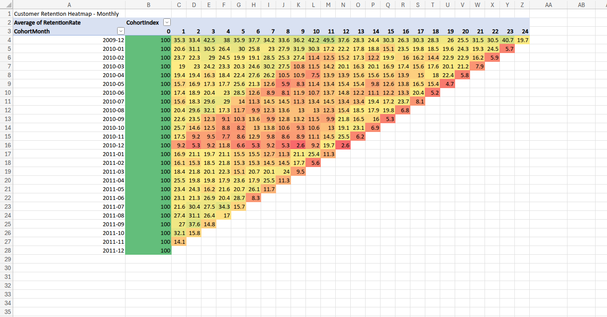

# Customer Cohort Analysis — Retention Tracking
**Tool:** SQL (Google BigQuery) + Microsoft Excel (heatmap visualisation)  
**Dataset:** Online Retail II (UCI Machine Learning Repository) — [Kaggle](https://www.kaggle.com/datasets/mashlyn/online-retail-ii-uci)

---

## Business Problem

Acquiring new customers is expensive. Retaining them is where profitability is built. This analysis answers the question:

**Of the customers who made their first purchase in a given month, how many came back in the following months — and does retention improve or decline over time?**

Cohort analysis is one of the most important tools in e-commerce analytics. It reveals whether a business has a retention problem, which acquisition periods produce the most loyal customers, and where re-engagement efforts should be focused.

---

## Dataset

- **Source:** Kaggle — Online Retail II (UCI Machine Learning Repository)
- **Size:** ~1 million rows of real UK e-commerce transactions (2009–2011)
- **Key columns used:** Invoice, InvoiceDate, Customer ID, Quantity

This is a real transactional dataset from a UK-based online gift retailer. The scale and messiness of the data makes it a realistic representation of what e-commerce businesses actually work with.

---

## Tools Used

- **SQL (Google BigQuery)** — data cleaning, cohort construction, retention rate calculation
- **Microsoft Excel** — pivot table and conditional formatting heatmap visualisation

---

## Methodology

### Data Cleaning (SQL)
Three filters were applied to remove unreliable records:
- Removed rows with null Customer ID (no customer to track)
- Removed negative quantities (returns and adjustments)
- Removed cancelled orders (invoices beginning with 'C')

### Cohort Construction (SQL)
1. Extracted the month of each transaction using `DATE_TRUNC`
2. Identified each customer's **first ever purchase month** (CohortMonth) using `MIN() OVER (PARTITION BY CustomerID)`
3. Calculated the **CohortIndex** — the number of months between a customer's first purchase and each subsequent purchase — using `DATE_DIFF`
4. Counted distinct customers for each CohortMonth / CohortIndex combination

### Retention Rate Calculation (SQL)
Used `FIRST_VALUE() OVER (PARTITION BY CohortMonth)` to capture the original cohort size (Month 0), then divided each month's customer count by that figure to produce a percentage retention rate.

### Visualisation (Excel)
Exported results to Excel and built a pivot table with CohortMonth as rows and CohortIndex as columns. Applied a Green–Yellow–Red conditional formatting colour scale to produce the retention heatmap.

---

## SQL Query

```sql
WITH clean_data AS (
  SELECT
    CAST(`Customer ID` AS STRING) AS CustomerID,
    DATE_TRUNC(CAST(InvoiceDate AS DATE), MONTH) AS OrderMonth
  FROM `cohort_analysis.online_retail`
  WHERE
    `Customer ID` IS NOT NULL
    AND Quantity > 0
    AND Invoice NOT LIKE 'C%'
),

cohort_base AS (
  SELECT
    CustomerID,
    OrderMonth,
    MIN(OrderMonth) OVER (PARTITION BY CustomerID) AS CohortMonth
  FROM clean_data
),

cohort_index AS (
  SELECT
    CustomerID,
    CohortMonth,
    OrderMonth,
    DATE_DIFF(OrderMonth, CohortMonth, MONTH) AS CohortIndex
  FROM cohort_base
),

cohort_table AS (
  SELECT
    CohortMonth,
    CohortIndex,
    COUNT(DISTINCT CustomerID) AS Customers
  FROM cohort_index
  GROUP BY CohortMonth, CohortIndex
)

SELECT
  CohortMonth,
  CohortIndex,
  Customers,
  FIRST_VALUE(Customers) OVER (PARTITION BY CohortMonth ORDER BY CohortIndex) AS CohortSize,
  ROUND(100.0 * Customers / FIRST_VALUE(Customers) OVER (PARTITION BY CohortMonth ORDER BY CohortIndex), 1) AS RetentionRate
FROM cohort_table
ORDER BY CohortMonth, CohortIndex
```

---

## Key Findings

- **Month 1 retention averages 20–35% across cohorts** — this is above the typical e-commerce benchmark of 20–30%, suggesting the retailer has a reasonably loyal customer base relative to industry norms.

- **The December 2009 cohort is the strongest**, with a Month 1 retention rate of 35.3%. Customers acquired during this period demonstrated consistently higher return rates over the following months, likely driven by the Christmas gifting season creating habitual purchasing behaviour.

- **The steepest drop-off occurs between Month 0 and Month 1** — retention falls from 100% to approximately 20–35% in the first month across all cohorts. This is the most critical window for re-engagement. A post-purchase email sequence or loyalty incentive targeted at first-time buyers could meaningfully improve this figure.

- **Retention stabilises at around 10–20% from Month 3 onwards** — customers who return for a third purchase tend to become long-term buyers. This suggests the business should focus re-engagement efforts on the first two months to convert one-time buyers into loyal customers.

- **Later 2011 cohorts show limited long-term data** — as expected, cohorts acquired closer to the end of the dataset have fewer follow-up months visible. This is a natural limitation of cohort analysis on time-bounded data, not a performance issue.

---

## Business Recommendations

1. **Prioritise Month 0 to Month 1 re-engagement** — this is where the majority of customers are lost. A targeted post-purchase email campaign (sent 2–3 weeks after first purchase) with a discount or personalised product recommendation could significantly improve Month 1 retention.

2. **Replicate the conditions of the December 2009 cohort** — investigate what was different about this acquisition period (promotions, product range, channel mix) and apply those learnings to future campaigns.

3. **Introduce a loyalty trigger at Month 2** — customers who return for a second purchase are significantly more likely to become long-term buyers. A loyalty reward or exclusive offer triggered after a second purchase could accelerate this transition.

4. **Monitor cohort retention by acquisition channel** — the next logical step for this analysis would be breaking cohorts down by marketing channel to identify which channels produce the most retained customers, not just the most first-time buyers.

---

## Heatmap



*Green = high retention, Red = low retention. Rows = acquisition month, Columns = months since first purchase.*

---

## How to Use

1. Download the dataset from the Kaggle link above
2. Upload to Google BigQuery as a table named `online_retail` within a dataset named `cohort_analysis`
3. Run the SQL query above to generate the cohort retention table
4. Export results to CSV and open in Excel
5. Build a pivot table (Rows: CohortMonth, Columns: CohortIndex, Values: Average RetentionRate)
6. Apply Green–Yellow–Red conditional formatting colour scale

---

## About HK Analytics

Data analytics consultancy helping small businesses understand their data.  
[Linktree](https://linktr.ee/hkanalyticsuk) | hello@hkanalytics.co.uk
